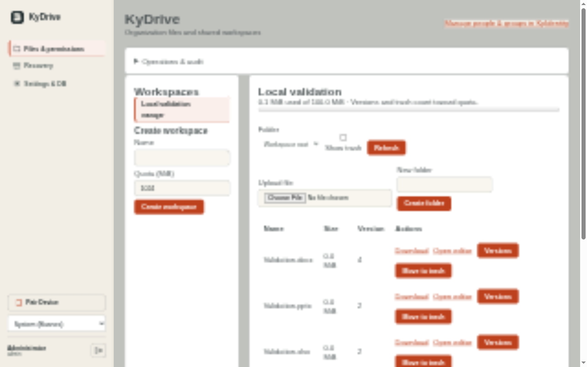
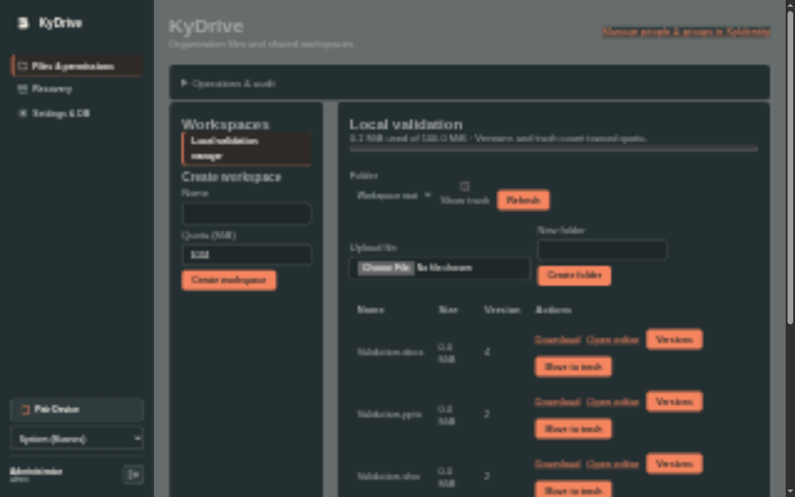
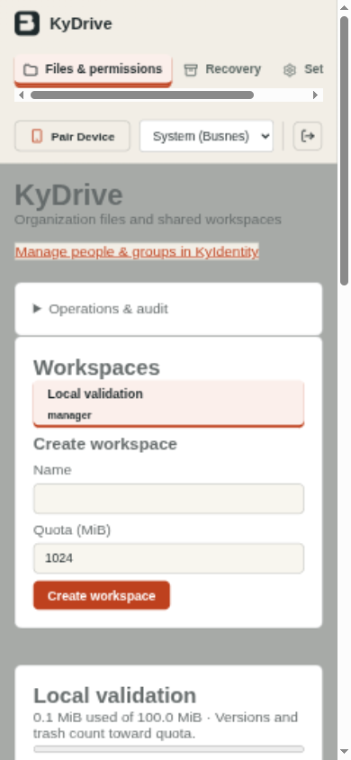
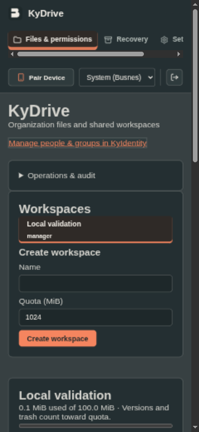
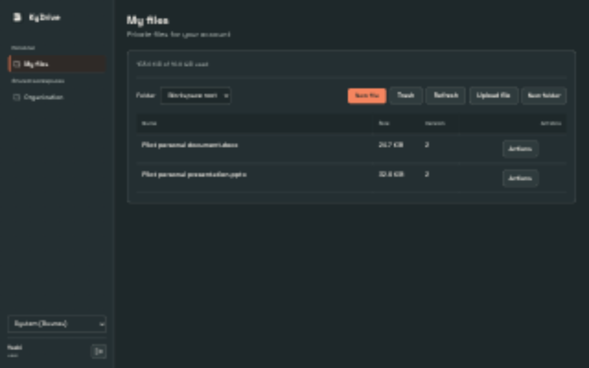
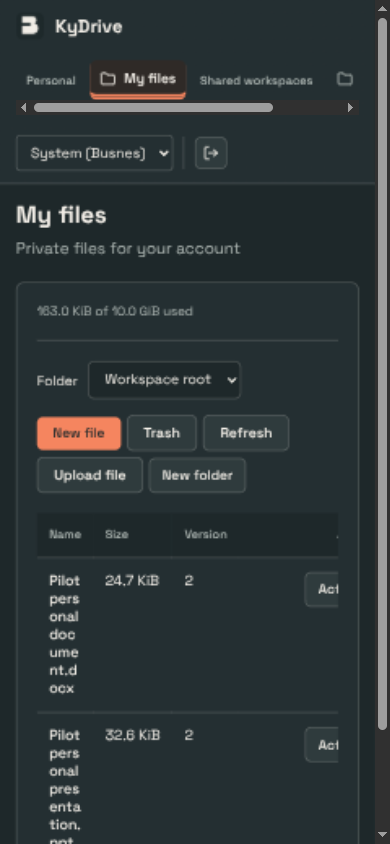

# KyDrive UI verification — 2026-10-03

Native T3 browser inspected the real local KyDrive container with three saved Euro-Office documents. Screenshots show OS-following Busnes Light/Dark at 1280×800 and 390×844 CSS pixels. Document width stayed within each viewport; navigation and file tables use local horizontal scrolling. This is visual/workflow evidence, not a complete accessibility audit.

| Light | Dark |
| --- | --- |
|  |  |
|  |  |

Checked actual file listing, revisions, permissions controls, identity navigation, theme changes and operations status. The status endpoint reported SCIM/editor/bulk configured and zero pending revocations; those flags describe local configuration, not live integration health. Native browser verified DOCX collaborative edits and revocation, plus XLSX/PPTX saves and reopen. See [acceptance](docs/ACCEPTANCE.md) for exact scope.

Frontend seven unit tests and TypeScript/production build passed; npm audit reported zero vulnerabilities. The inherited browser regression harness is available but was not executed as standalone Playwright in this task. No claim of every palette/page combination or full keyboard/accessibility coverage is made.

## Live file layout — 2026-10-04

UI commit `e49f2b6` was deployed after CI and provenance verification. Native T3 preview checked Yoshi's actual SSO session and group-granted Organization workspace at 1280×800 and 390×844. Pair Device is absent. Files open by default; Workspace settings displays group permissions separately. The table shows the saved spreadsheet at 8.3 KiB/version 2; small file sizes no longer round to zero. Both widths fit the document; the mobile table uses its own horizontal scrolling. The user-requested layout change preserves theme choices and server authorization. No standalone browser suite or full accessibility audit was run for this change.

## Personal/shared navigation and new files — 2026-10-04

Current deployed source `109e6f6` / CI 37182399482 passed. Native T3 preview verified Yoshi's My files and Organization directly in the main sidebar; no redundant global Files destination or nested workspace panel. Actual New file dialogs created DOCX and PPTX in My files and XLSX in Organization and opened each in Euro-Office. Edits produced revision 2; authenticated OOXML downloads verified K/S/P. Test files were moved to trash after checks. Personal isolation/offboarding and all three creation kinds are also covered by real domain/API tests in passing race CI.

Native captures of the final release at 1280×800 and 390×844 are below. Neither had document overflow. Named theme choices remain intact. This is workflow/layout evidence, not a full accessibility audit or standalone browser-suite run.

| Desktop | Mobile |
| --- | --- |
|  |  |
